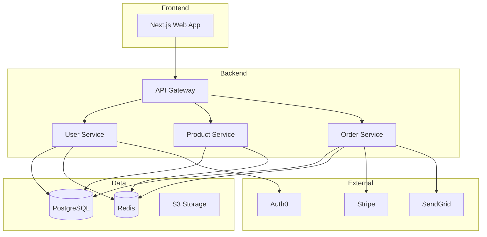
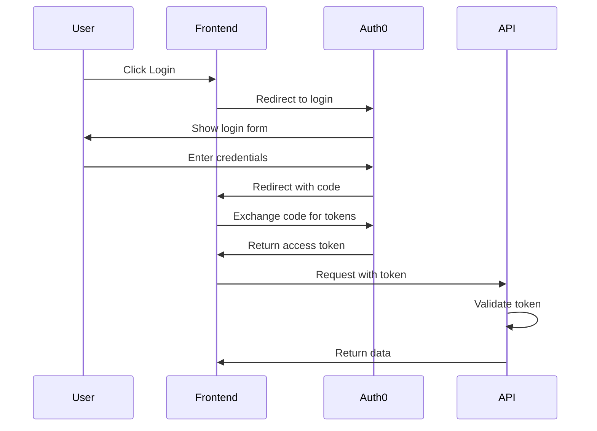
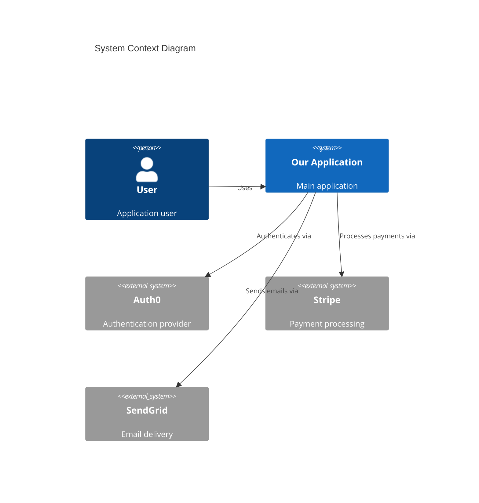
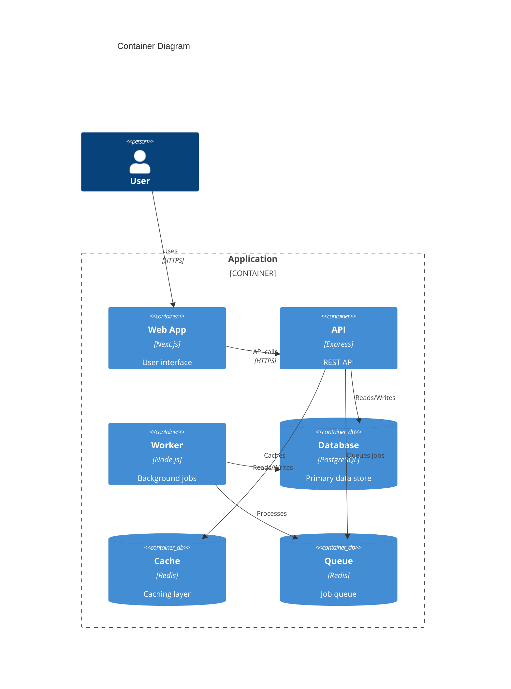

# Onboarding Documentation Template

## Overview
Templates and tools for creating developer onboarding documentation including setup guides, architecture overviews, and team practices.

## Quick Start
```bash
mkdir -p docs/onboarding
cp templates/onboarding/*.md docs/onboarding/
```

## Developer Onboarding Guide

### getting-started.md
```markdown
# Developer Onboarding Guide

Welcome to the team! This guide will help you get set up and productive quickly.

## Table of Contents

1. [Day 1: Environment Setup](#day-1-environment-setup)
2. [Day 2: Codebase Tour](#day-2-codebase-tour)
3. [Week 1: First Contribution](#week-1-first-contribution)
4. [Week 2: Deep Dive](#week-2-deep-dive)
5. [Resources](#resources)

---

## Day 1: Environment Setup

### Prerequisites

Ensure you have the following accounts:
- [ ] GitHub access (request from @team-lead)
- [ ] Slack workspace (check email for invite)
- [ ] Jira/Linear access (auto-provisioned)
- [ ] AWS Console (request from @devops)
- [ ] 1Password vault access

### Required Software

Install the following tools:

```bash
# macOS (using Homebrew)
brew install git node@20 docker docker-compose postgresql@15 redis
brew install --cask visual-studio-code slack

# Verify installations
git --version    # Should be >= 2.40
node --version   # Should be >= 20.0
docker --version # Should be >= 24.0
```

### IDE Setup

1. Install VS Code extensions:
   ```bash
   code --install-extension dbaeumer.vscode-eslint
   code --install-extension esbenp.prettier-vscode
   code --install-extension ms-azuretools.vscode-docker
   code --install-extension bradlc.vscode-tailwindcss
   code --install-extension GitHub.copilot
   ```

2. Copy workspace settings:
   ```bash
   cp .vscode/settings.json.example .vscode/settings.json
   ```

### Clone and Setup

```bash
# Clone the repository
git clone git@github.com:company/main-app.git
cd main-app

# Install dependencies
npm install

# Copy environment file
cp .env.example .env.local

# Set up local database
docker-compose up -d postgres redis
npm run db:migrate
npm run db:seed

# Verify setup
npm run dev
# Open http://localhost:3000
```

### Verify Everything Works

Run the verification script:

```bash
npm run verify-setup

# Expected output:
# ✅ Node.js version OK
# ✅ Dependencies installed
# ✅ Database connection OK
# ✅ Redis connection OK
# ✅ Environment variables OK
# ✅ Tests passing
```

---

## Day 2: Codebase Tour

### Project Structure

```
├── apps/
│   ├── web/                 # Next.js frontend
│   │   ├── app/             # App router pages
│   │   ├── components/      # React components
│   │   └── lib/             # Utilities
│   ├── api/                 # Express.js backend
│   │   ├── routes/          # API routes
│   │   ├── services/        # Business logic
│   │   ├── models/          # Database models
│   │   └── middleware/      # Express middleware
│   └── worker/              # Background job processor
├── packages/
│   ├── shared/              # Shared utilities
│   ├── config/              # Shared config
│   └── types/               # TypeScript types
├── infrastructure/
│   ├── terraform/           # Infrastructure as code
│   └── kubernetes/          # K8s manifests
└── docs/                    # Documentation
```

### Key Files to Read

Start with these files to understand the codebase:

| File | Purpose |
|------|---------|
| `CLAUDE.md` | AI assistant context |
| `apps/api/routes/index.ts` | API route registration |
| `apps/web/app/layout.tsx` | Main layout component |
| `packages/shared/src/index.ts` | Shared utilities |
| `.github/workflows/ci.yml` | CI/CD pipeline |

### Architecture Overview



### Important Patterns

#### API Routes Pattern
```typescript
// All API routes follow this pattern
// apps/api/routes/users.ts
import { Router } from 'express';
import { UserService } from '../services/user.service';
import { authenticate } from '../middleware/auth';
import { validate } from '../middleware/validate';
import { createUserSchema } from '../schemas/user.schema';

const router = Router();

router.get('/', authenticate, async (req, res) => {
  const users = await UserService.findAll(req.query);
  res.json(users);
});

router.post('/', authenticate, validate(createUserSchema), async (req, res) => {
  const user = await UserService.create(req.body);
  res.status(201).json(user);
});

export default router;
```

#### React Component Pattern
```typescript
// All components follow this pattern
// apps/web/components/UserCard.tsx
import { type FC } from 'react';
import { User } from '@company/types';

interface UserCardProps {
  user: User;
  onEdit?: (user: User) => void;
  className?: string;
}

export const UserCard: FC<UserCardProps> = ({
  user,
  onEdit,
  className
}) => {
  return (
    <div className={cn('rounded-lg border p-4', className)}>
      <h3>{user.name}</h3>
      <p>{user.email}</p>
      {onEdit && (
        <button onClick={() => onEdit(user)}>Edit</button>
      )}
    </div>
  );
};
```

---

## Week 1: First Contribution

### Find Your First Task

1. Check the `good-first-issue` label in GitHub Issues
2. Look at the Jira board for tasks marked "Starter"
3. Ask your buddy for recommendations

### Development Workflow

```bash
# 1. Create a branch
git checkout -b feature/your-feature-name

# 2. Make changes
# ... write code ...

# 3. Run tests locally
npm run test
npm run lint
npm run typecheck

# 4. Commit with conventional commits
git commit -m "feat(users): add email validation"

# 5. Push and create PR
git push -u origin feature/your-feature-name
```

### PR Checklist

Before submitting a PR:

- [ ] Tests pass locally
- [ ] Linting passes
- [ ] TypeScript compiles without errors
- [ ] PR description explains the change
- [ ] Screenshots for UI changes
- [ ] Documentation updated if needed

### Code Review Process

1. Create PR with description
2. Request review from team member
3. Address feedback
4. Get approval
5. Squash and merge

---

## Week 2: Deep Dive

### Database Schema

Explore the database:

```bash
# Connect to local database
npm run db:studio
# Opens Prisma Studio at http://localhost:5555
```

Key tables:
- `users` - User accounts
- `organizations` - Multi-tenant organizations
- `products` - Product catalog
- `orders` - Customer orders

### Authentication Flow

We use Auth0 for authentication:



### Background Jobs

We use BullMQ for background jobs:

```typescript
// Common job patterns
// apps/worker/jobs/sendEmail.job.ts

import { Job } from 'bullmq';

interface SendEmailPayload {
  to: string;
  template: string;
  data: Record<string, unknown>;
}

export async function sendEmailJob(job: Job<SendEmailPayload>) {
  const { to, template, data } = job.data;

  await emailService.send({
    to,
    template,
    data
  });
}

// To queue a job from the API:
import { emailQueue } from '@company/shared';

await emailQueue.add('send-welcome', {
  to: user.email,
  template: 'welcome',
  data: { name: user.name }
});
```

---

## Resources

### Documentation

| Resource | Link |
|----------|------|
| API Documentation | `/docs/api` |
| Architecture | `/docs/architecture` |
| Runbooks | `/docs/runbooks` |
| ADRs | `/docs/adr` |

### Communication

| Channel | Purpose |
|---------|---------|
| #engineering | General engineering discussion |
| #code-review | PR review requests |
| #incidents | Production issues |
| #random | Fun stuff |

### Key People

| Role | Name | Slack |
|------|------|-------|
| Team Lead | Jane Doe | @jane |
| Your Buddy | John Smith | @john |
| DevOps | Bob Wilson | @bob |
| Product | Alice Brown | @alice |

### Learning Resources

- [Internal Wiki](https://wiki.company.com)
- [Architecture Videos](https://drive.google.com/drive/architecture)
- [Past Post-Mortems](https://docs.company.com/postmortems)

---

## Checklist

### End of Day 1
- [ ] Environment fully set up
- [ ] App runs locally
- [ ] All accounts provisioned
- [ ] Met with buddy

### End of Week 1
- [ ] Completed codebase tour
- [ ] Submitted first PR
- [ ] Attended team standup
- [ ] Read key documentation

### End of Week 2
- [ ] First PR merged
- [ ] Understand main workflows
- [ ] Know who to ask for help
- [ ] Comfortable with tools

---

## Questions?

- Ask your buddy first
- Post in #engineering
- Check the wiki
- Schedule 1:1 with team lead
```

## Setup Verification Script

```typescript
// scripts/verify-setup.ts
import { execSync } from 'child_process';
import * as fs from 'fs';
import * as path from 'path';

interface CheckResult {
  name: string;
  passed: boolean;
  message: string;
}

class SetupVerifier {
  private results: CheckResult[] = [];

  async verify(): Promise<void> {
    console.log('🔍 Verifying development setup...\n');

    await this.checkNodeVersion();
    await this.checkDependencies();
    await this.checkEnvFile();
    await this.checkDatabase();
    await this.checkRedis();
    await this.checkTests();

    this.printResults();
  }

  private async checkNodeVersion(): Promise<void> {
    try {
      const version = execSync('node --version').toString().trim();
      const major = parseInt(version.slice(1).split('.')[0]);

      this.results.push({
        name: 'Node.js version',
        passed: major >= 20,
        message: major >= 20
          ? `OK (${version})`
          : `Version ${version} is below required v20+`
      });
    } catch {
      this.results.push({
        name: 'Node.js version',
        passed: false,
        message: 'Node.js not found'
      });
    }
  }

  private async checkDependencies(): Promise<void> {
    const nodeModulesExists = fs.existsSync('./node_modules');
    const lockFileExists = fs.existsSync('./package-lock.json') ||
                          fs.existsSync('./yarn.lock') ||
                          fs.existsSync('./pnpm-lock.yaml');

    this.results.push({
      name: 'Dependencies installed',
      passed: nodeModulesExists,
      message: nodeModulesExists
        ? 'OK'
        : 'Run npm install to install dependencies'
    });
  }

  private async checkEnvFile(): Promise<void> {
    const envExists = fs.existsSync('.env.local') || fs.existsSync('.env');

    if (!envExists) {
      this.results.push({
        name: 'Environment variables',
        passed: false,
        message: 'Copy .env.example to .env.local'
      });
      return;
    }

    const requiredVars = [
      'DATABASE_URL',
      'REDIS_URL',
      'JWT_SECRET',
      'AUTH0_DOMAIN'
    ];

    const envContent = fs.readFileSync(
      fs.existsSync('.env.local') ? '.env.local' : '.env',
      'utf-8'
    );

    const missingVars = requiredVars.filter(v => !envContent.includes(v));

    this.results.push({
      name: 'Environment variables',
      passed: missingVars.length === 0,
      message: missingVars.length === 0
        ? 'OK'
        : `Missing: ${missingVars.join(', ')}`
    });
  }

  private async checkDatabase(): Promise<void> {
    try {
      execSync('npm run db:check', { stdio: 'pipe' });
      this.results.push({
        name: 'Database connection',
        passed: true,
        message: 'OK'
      });
    } catch {
      this.results.push({
        name: 'Database connection',
        passed: false,
        message: 'Cannot connect. Run: docker-compose up -d postgres'
      });
    }
  }

  private async checkRedis(): Promise<void> {
    try {
      execSync('redis-cli ping', { stdio: 'pipe' });
      this.results.push({
        name: 'Redis connection',
        passed: true,
        message: 'OK'
      });
    } catch {
      this.results.push({
        name: 'Redis connection',
        passed: false,
        message: 'Cannot connect. Run: docker-compose up -d redis'
      });
    }
  }

  private async checkTests(): Promise<void> {
    try {
      execSync('npm run test -- --passWithNoTests --silent', { stdio: 'pipe' });
      this.results.push({
        name: 'Tests passing',
        passed: true,
        message: 'OK'
      });
    } catch {
      this.results.push({
        name: 'Tests passing',
        passed: false,
        message: 'Some tests failing. Run: npm run test'
      });
    }
  }

  private printResults(): void {
    console.log('Results:\n');

    for (const result of this.results) {
      const icon = result.passed ? '✅' : '❌';
      console.log(`${icon} ${result.name}: ${result.message}`);
    }

    const allPassed = this.results.every(r => r.passed);
    console.log('\n' + (allPassed
      ? '🎉 All checks passed! You\'re ready to start.'
      : '⚠️  Some checks failed. Please fix the issues above.'
    ));

    process.exit(allPassed ? 0 : 1);
  }
}

// Run verification
new SetupVerifier().verify();
```

## Architecture Overview Template

```markdown
# Architecture Overview

## System Context



## Container View



## Data Flow

### Request Flow
1. User makes request to web app
2. Web app calls API
3. API authenticates request
4. API processes business logic
5. API reads/writes database
6. Response returned to user

### Background Job Flow
1. API queues job to Redis
2. Worker picks up job
3. Worker processes job
4. Worker updates database
5. Optional: notification sent
```

## CLAUDE.md Integration

```markdown
## Onboarding Documentation

### Document Types
- **Setup Guide** - Environment setup
- **Codebase Tour** - Project structure
- **Architecture** - System design
- **Workflows** - Development processes

### Required Sections
1. Prerequisites and accounts
2. Installation steps
3. Verification steps
4. Key files and patterns
5. Resources and contacts

### Commands
- `npm run verify-setup` - Verify environment
- `npm run docs:onboarding` - Generate docs
```

## AI Suggestions

1. **Auto-detect missing setup** - Identify missing tools
2. **Environment validation** - Verify all variables
3. **Codebase tour generation** - Auto-generate from structure
4. **Diagram creation** - Generate architecture diagrams
5. **Checklist tracking** - Track onboarding progress
6. **Knowledge gap detection** - Suggest learning resources
7. **Tool installation** - Auto-install missing tools
8. **Configuration copying** - Set up dotfiles automatically
9. **Buddy matching** - Suggest mentors based on skills
10. **Progress dashboard** - Visualize onboarding status
