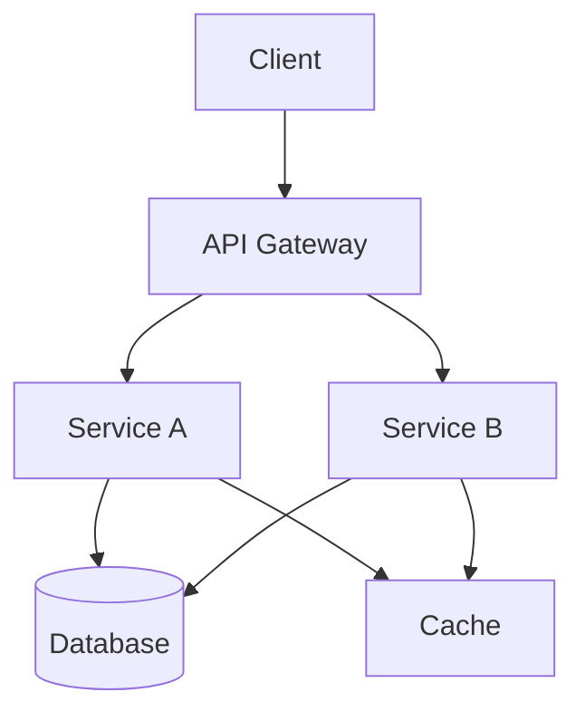

# Technical Specifications Template

## Overview
Templates and tools for creating comprehensive technical specification documents including RFCs, design docs, and system specifications.

## Quick Start
```bash
mkdir -p docs/specs
cp templates/spec-template.md docs/specs/SPEC-001-feature-name.md
```

## Technical Specification Template

### SPEC-XXX-feature-name.md
```markdown
# SPEC-XXX: Feature Name

| Field | Value |
|-------|-------|
| **Status** | Draft / In Review / Approved / Implemented / Deprecated |
| **Author(s)** | @username, @username |
| **Created** | YYYY-MM-DD |
| **Updated** | YYYY-MM-DD |
| **Reviewers** | @reviewer1, @reviewer2 |
| **Approved By** | @approver |
| **Implementation** | PR #123, PR #456 |

## Summary

One-paragraph summary of what this specification proposes.

## Motivation

### Problem Statement

Describe the problem this specification addresses:

- What is the current state?
- What pain points exist?
- Who is affected?

### Goals

- [ ] Primary goal 1
- [ ] Primary goal 2
- [ ] Secondary goal

### Non-Goals

Things explicitly out of scope:

- Item 1
- Item 2

## Background

### Current Architecture

```
┌─────────────┐     ┌─────────────┐     ┌─────────────┐
│   Client    │────▶│   Server    │────▶│  Database   │
└─────────────┘     └─────────────┘     └─────────────┘
```

### Prior Art

Links to related systems, papers, or implementations:

- [Similar System A](link) - How they solved it
- [Research Paper B](link) - Relevant findings

### Definitions

| Term | Definition |
|------|------------|
| Term 1 | Definition of term 1 |
| Term 2 | Definition of term 2 |

## Detailed Design

### Overview

High-level description of the proposed solution.

### Architecture



### Data Model

#### New Entities

```typescript
interface NewEntity {
  id: string;          // UUID v4
  name: string;        // Display name, max 255 chars
  status: Status;      // Entity status
  metadata: Record<string, unknown>;
  createdAt: Date;
  updatedAt: Date;
}

enum Status {
  DRAFT = 'draft',
  ACTIVE = 'active',
  ARCHIVED = 'archived'
}
```

#### Database Schema

```sql
CREATE TABLE new_entities (
  id UUID PRIMARY KEY DEFAULT gen_random_uuid(),
  name VARCHAR(255) NOT NULL,
  status VARCHAR(50) NOT NULL DEFAULT 'draft',
  metadata JSONB DEFAULT '{}',
  created_at TIMESTAMPTZ DEFAULT NOW(),
  updated_at TIMESTAMPTZ DEFAULT NOW(),

  CONSTRAINT valid_status CHECK (status IN ('draft', 'active', 'archived'))
);

CREATE INDEX idx_new_entities_status ON new_entities(status);
CREATE INDEX idx_new_entities_created_at ON new_entities(created_at);
```

### API Design

#### Endpoints

##### Create Entity

```http
POST /api/v1/entities
Content-Type: application/json
Authorization: Bearer <token>

{
  "name": "Entity Name",
  "metadata": {
    "key": "value"
  }
}
```

**Response (201 Created):**
```json
{
  "id": "uuid",
  "name": "Entity Name",
  "status": "draft",
  "metadata": { "key": "value" },
  "createdAt": "2024-01-15T10:30:00Z",
  "updatedAt": "2024-01-15T10:30:00Z"
}
```

##### List Entities

```http
GET /api/v1/entities?status=active&page=1&limit=20
Authorization: Bearer <token>
```

**Response (200 OK):**
```json
{
  "data": [...],
  "pagination": {
    "page": 1,
    "limit": 20,
    "total": 100,
    "totalPages": 5
  }
}
```

#### Error Responses

| Code | Description | Response |
|------|-------------|----------|
| 400 | Validation Error | `{ "error": "validation_error", "message": "...", "details": [...] }` |
| 401 | Unauthorized | `{ "error": "unauthorized", "message": "..." }` |
| 404 | Not Found | `{ "error": "not_found", "message": "..." }` |
| 500 | Server Error | `{ "error": "internal_error", "message": "..." }` |

### Security Considerations

#### Authentication

- All endpoints require Bearer token authentication
- Tokens are JWTs with 1-hour expiry
- Refresh tokens have 7-day expiry

#### Authorization

| Action | Required Permission |
|--------|---------------------|
| Create | `entities:create` |
| Read | `entities:read` |
| Update | `entities:update` |
| Delete | `entities:delete` |

#### Data Protection

- PII fields are encrypted at rest using AES-256
- All API traffic uses TLS 1.3
- Audit logs for all write operations

### Performance Requirements

| Metric | Requirement |
|--------|-------------|
| P50 Latency | < 50ms |
| P99 Latency | < 200ms |
| Throughput | > 1000 RPS |
| Availability | 99.9% |

### Monitoring & Observability

#### Metrics

- `entity_created_total` - Counter of created entities
- `entity_operation_duration_seconds` - Histogram of operation latency
- `entity_errors_total` - Counter of errors by type

#### Alerts

| Alert | Condition | Severity |
|-------|-----------|----------|
| High Error Rate | error_rate > 1% for 5m | Critical |
| High Latency | p99 > 500ms for 5m | Warning |
| Low Availability | availability < 99.9% | Critical |

## Alternatives Considered

### Alternative 1: [Name]

**Description:** Brief description of the alternative.

**Pros:**
- Pro 1
- Pro 2

**Cons:**
- Con 1
- Con 2

**Why rejected:** Reason for not choosing this approach.

### Alternative 2: [Name]

**Description:** Brief description of the alternative.

**Pros:**
- Pro 1

**Cons:**
- Con 1

**Why rejected:** Reason for not choosing this approach.

## Migration Strategy

### Phase 1: Preparation

1. Create database schema
2. Deploy new service version (feature-flagged)
3. Set up monitoring

### Phase 2: Migration

1. Enable feature for internal users
2. Migrate existing data
3. Gradually roll out to all users

### Phase 3: Cleanup

1. Remove feature flag
2. Remove old code paths
3. Archive old data

### Rollback Plan

If issues are detected:

1. Disable feature flag
2. Route traffic to old implementation
3. Investigate and fix issues

## Testing Strategy

### Unit Tests

- Test all business logic
- Mock external dependencies
- Target 80%+ coverage

### Integration Tests

- Test API endpoints
- Test database operations
- Test external service integrations

### Performance Tests

- Load test with expected traffic
- Stress test to find breaking points
- Soak test for memory leaks

## Timeline

| Milestone | Target Date | Status |
|-----------|-------------|--------|
| Spec Approval | YYYY-MM-DD | ⏳ Pending |
| Implementation Start | YYYY-MM-DD | ⏳ Pending |
| Alpha Release | YYYY-MM-DD | ⏳ Pending |
| Beta Release | YYYY-MM-DD | ⏳ Pending |
| GA Release | YYYY-MM-DD | ⏳ Pending |

## Open Questions

- [ ] Question 1 - @assignee
- [ ] Question 2 - @assignee

## References

- [Link 1](url) - Description
- [Link 2](url) - Description

## Changelog

| Date | Author | Changes |
|------|--------|---------|
| YYYY-MM-DD | @author | Initial draft |
| YYYY-MM-DD | @author | Added API design section |

---

## Approval

### Technical Review

- [ ] @reviewer1 - Architecture review
- [ ] @reviewer2 - Security review
- [ ] @reviewer3 - API design review

### Sign-off

- [ ] Engineering Lead
- [ ] Product Manager
- [ ] Security Team (if applicable)
```

## RFC Template

### RFC-XXX.md
```markdown
# RFC XXX: Title

- **Authors:** @author1, @author2
- **Status:** Draft | Discussion | Accepted | Rejected | Superseded
- **Created:** YYYY-MM-DD
- **Discussion:** [Link to discussion thread]

## Abstract

A short (~200 word) description of the technical issue being addressed.

## Specification

The technical specification should describe the syntax and semantics of any
new feature. The specification should be detailed enough to allow competing,
interoperable implementations.

### Syntax

```
new_syntax := 'keyword' identifier '{' body '}'
```

### Semantics

Describe how the feature behaves:

1. Step one
2. Step two
3. Step three

### Examples

```typescript
// Example 1: Basic usage
const result = newFeature({
  option: 'value'
});

// Example 2: Advanced usage
const advanced = newFeature({
  option: 'value',
  nested: {
    deep: true
  }
});
```

## Motivation

Why is this change necessary? What problem does it solve?

### Use Cases

1. **Use Case 1:** Description
2. **Use Case 2:** Description

## Rationale

Why is this design the best in the space of possible designs?

### Design Decisions

| Decision | Rationale |
|----------|-----------|
| Decision 1 | Why we made this choice |
| Decision 2 | Why we made this choice |

## Backwards Compatibility

How does this affect existing code? What migration is required?

### Breaking Changes

List any breaking changes:

- Change 1: How to migrate
- Change 2: How to migrate

## Security Implications

What are the security implications of this change?

## Reference Implementation

Link to or include reference implementation.

## Drawbacks

What are the downsides of this approach?

## Unresolved Questions

- Question 1
- Question 2

## Future Possibilities

What future extensions might this enable?
```

## Design Document Generator

```typescript
// tools/spec-generator.ts
import * as fs from 'fs';
import * as path from 'path';
import * as readline from 'readline';

interface SpecMetadata {
  id: string;
  title: string;
  authors: string[];
  reviewers: string[];
  type: 'spec' | 'rfc' | 'design';
}

class SpecGenerator {
  private templatesDir: string;
  private outputDir: string;

  constructor(templatesDir = './templates', outputDir = './docs/specs') {
    this.templatesDir = templatesDir;
    this.outputDir = outputDir;
  }

  async generateSpec(metadata: SpecMetadata): Promise<string> {
    // Load template
    const templatePath = path.join(this.templatesDir, `${metadata.type}-template.md`);
    let template = fs.readFileSync(templatePath, 'utf-8');

    // Replace placeholders
    template = template
      .replace(/\{\{ID\}\}/g, metadata.id)
      .replace(/\{\{TITLE\}\}/g, metadata.title)
      .replace(/\{\{AUTHORS\}\}/g, metadata.authors.join(', '))
      .replace(/\{\{REVIEWERS\}\}/g, metadata.reviewers.join(', '))
      .replace(/\{\{DATE\}\}/g, new Date().toISOString().split('T')[0]);

    // Generate filename
    const filename = `${metadata.type.toUpperCase()}-${metadata.id}-${this.slugify(metadata.title)}.md`;
    const outputPath = path.join(this.outputDir, filename);

    // Ensure directory exists
    fs.mkdirSync(this.outputDir, { recursive: true });

    // Write file
    fs.writeFileSync(outputPath, template);

    return outputPath;
  }

  private slugify(text: string): string {
    return text
      .toLowerCase()
      .replace(/[^\w\s-]/g, '')
      .replace(/\s+/g, '-')
      .replace(/-+/g, '-')
      .trim();
  }

  async interactiveCreate(): Promise<void> {
    const rl = readline.createInterface({
      input: process.stdin,
      output: process.stdout
    });

    const question = (prompt: string): Promise<string> => {
      return new Promise(resolve => {
        rl.question(prompt, resolve);
      });
    };

    try {
      const type = await question('Type (spec/rfc/design): ') as 'spec' | 'rfc' | 'design';
      const id = await question('ID (e.g., 001): ');
      const title = await question('Title: ');
      const authors = (await question('Authors (comma-separated @usernames): ')).split(',').map(s => s.trim());
      const reviewers = (await question('Reviewers (comma-separated @usernames): ')).split(',').map(s => s.trim());

      const outputPath = await this.generateSpec({
        id,
        title,
        authors,
        reviewers,
        type
      });

      console.log(`\nSpec created: ${outputPath}`);
    } finally {
      rl.close();
    }
  }
}

// CLI
if (require.main === module) {
  const generator = new SpecGenerator();
  generator.interactiveCreate().catch(console.error);
}

export { SpecGenerator };
```

## Spec Index Generator

```typescript
// tools/spec-index.ts
import * as fs from 'fs';
import * as path from 'path';

interface SpecEntry {
  id: string;
  title: string;
  status: string;
  authors: string[];
  created: string;
  path: string;
}

class SpecIndexGenerator {
  private specsDir: string;

  constructor(specsDir = './docs/specs') {
    this.specsDir = specsDir;
  }

  generateIndex(): string {
    const specs = this.parseSpecs();

    // Group by status
    const byStatus = this.groupBy(specs, 'status');

    let markdown = '# Technical Specifications Index\n\n';
    markdown += `Last updated: ${new Date().toISOString().split('T')[0]}\n\n`;

    // Summary table
    markdown += '## Summary\n\n';
    markdown += '| Status | Count |\n';
    markdown += '|--------|-------|\n';
    for (const [status, items] of Object.entries(byStatus)) {
      markdown += `| ${status} | ${items.length} |\n`;
    }
    markdown += '\n';

    // Specs by status
    for (const [status, items] of Object.entries(byStatus)) {
      markdown += `## ${status}\n\n`;
      markdown += '| ID | Title | Authors | Created |\n';
      markdown += '|----|-------|---------|--------|\n';

      for (const spec of items) {
        markdown += `| [${spec.id}](${spec.path}) | ${spec.title} | ${spec.authors.join(', ')} | ${spec.created} |\n`;
      }
      markdown += '\n';
    }

    return markdown;
  }

  private parseSpecs(): SpecEntry[] {
    const specs: SpecEntry[] = [];
    const files = fs.readdirSync(this.specsDir).filter(f => f.endsWith('.md'));

    for (const file of files) {
      const filePath = path.join(this.specsDir, file);
      const content = fs.readFileSync(filePath, 'utf-8');

      const spec = this.parseSpecFile(content, file);
      if (spec) {
        specs.push(spec);
      }
    }

    return specs.sort((a, b) => a.id.localeCompare(b.id));
  }

  private parseSpecFile(content: string, filename: string): SpecEntry | null {
    // Extract metadata from frontmatter or table
    const titleMatch = content.match(/^#\s+(?:SPEC|RFC|DESIGN)-(\d+):\s+(.+)$/m);
    const statusMatch = content.match(/\*\*Status\*\*\s*\|\s*(.+?)\s*\|/);
    const authorMatch = content.match(/\*\*Author\(s\)\*\*\s*\|\s*(.+?)\s*\|/);
    const createdMatch = content.match(/\*\*Created\*\*\s*\|\s*(.+?)\s*\|/);

    if (!titleMatch) return null;

    return {
      id: titleMatch[1],
      title: titleMatch[2],
      status: statusMatch?.[1]?.trim() || 'Unknown',
      authors: authorMatch?.[1]?.split(',').map(s => s.trim()) || [],
      created: createdMatch?.[1]?.trim() || '',
      path: `./${filename}`
    };
  }

  private groupBy<T>(array: T[], key: keyof T): Record<string, T[]> {
    return array.reduce((acc, item) => {
      const groupKey = String(item[key]);
      acc[groupKey] = acc[groupKey] || [];
      acc[groupKey].push(item);
      return acc;
    }, {} as Record<string, T[]>);
  }
}

export { SpecIndexGenerator };
```

## CLAUDE.md Integration

```markdown
## Technical Specifications

### Spec Types
- **SPEC** - Feature specifications
- **RFC** - Request for comments
- **DESIGN** - Design documents

### Status Flow
Draft → In Review → Approved → Implemented → Deprecated

### Required Sections
1. Summary and motivation
2. Detailed design with diagrams
3. API specifications
4. Security considerations
5. Alternatives considered
6. Migration strategy

### Commands
- `npm run spec:new` - Create new spec
- `npm run spec:index` - Update index
- `npm run spec:validate` - Validate specs
```

## AI Suggestions

1. **Auto-generate specs** - Create spec from code changes
2. **Spec validation** - Check required sections
3. **Diagram generation** - Create architecture diagrams
4. **API extraction** - Generate API specs from code
5. **Status tracking** - Monitor spec lifecycle
6. **Cross-reference links** - Link related specs
7. **Review assignment** - Auto-assign reviewers
8. **Changelog sync** - Update changelog from specs
9. **Template customization** - Build custom templates
10. **Spec search** - Full-text search across specs
